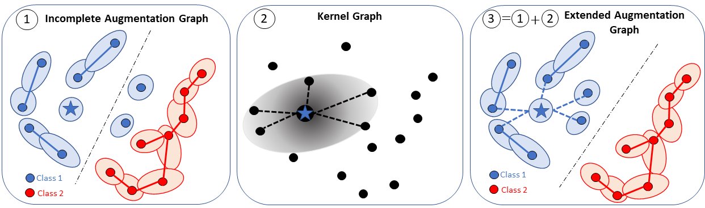

# Integrating Prior Knowledge in Contrastive Learning with Kernel

Benoit Dufumier, Carlo Alberto Barbano, Robin Louiset, Edouard Duchesnay, Pietro Gori | [[pdf](https://arxiv.org/pdf/2206.01646.pdf)]

This is a PyTorch implementation of Decoupled Uniformity. 


**Abstract.** Data augmentation is a crucial component in unsupervised contrastive learning (CL).
It determines how positive samples are defined and, ultimately, the quality of the learnt representation. In this work, 
we open the door to new perspectives for CL by integrating prior knowledge, given either by generative models--viewed as 
prior representations-- or weak attributes in the positive and negative sampling.
To this end, we use kernel theory to propose a novel loss, called *decoupled uniformity*, that i) allows the integration 
of prior knowledge and ii) removes the negative-positive coupling in the original InfoNCE loss. We draw a connection 
between contrastive learning and conditional mean embedding theory to derive tight bounds on the downstream classification 
loss. In an unsupervised setting, we empirically demonstrate that CL benefits from generative models to improve its 
representation both on natural and medical images. In a weakly supervised scenario, our framework outperforms other 
unconditional and conditional CL approaches.



## Requirements

* python >= 3.6
* pytorch >= 1.6
* torchvision

**Manual downloading of datasets:**
* ImageNet can be dowloaded following the [official PyTorch ImageNet training code](https://github.com/pytorch/examples/tree/main/imagenet).
* CheXpert can be downloaded at this [official webpage](https://stanfordmlgroup.github.io/competitions/chexpert/) by filling a registration form.  

## Unsupervised pretraining without prior

To pre-train your backbone without prior knowledge (i.e. without kernel) using Decoupled Uniformity, you can use the 
following scripts. It allows multi-GPU DistributedDataParallel training on one or more nodes. 

### CIFAR10/CIFAR100

To reproduce our results on CIFAR10/CIFAR100, try the following command (replace by `--db cifar100` for CIFAR100): 

```bash
python src/main_decoupled_unif.py --root [YOUR CIFAR10/100 DATA FOLDER] --save_dir [YOUR CHECKPOINT PATH] \ 
                                  --batch_size 256 --lr 0.3 \
                                  --optimizer sgd --network resnet18 --db cifar10 \
                                  --multiprocessing-distributed
```

This script will perform pre-training for 400 epochs with ResNet18 backbone and all default hyper-parameters described
in our paper. 

### ImageNet100

For bigger-scale training (e.g. ImageNet100) using ResNet50 backbone, try the following command:

```bash
python src/main_decoupled_unif.py --root [YOUR IMAGENET DATA FOLDER] --save_dir [YOUR CHECKPOINT PATH] \ 
                                  --batch_size 256 --lr 0.3 \
                                  --optimizer lars --wd 1e-6 --network resnet50 \
                                  --db imagenet100 --multiprocessing-distributed
```


## Pretraining with prior knowledge

### Generating weak features as prior knowledge

**Can generative models improve CL representations ?** To answer to this question, we embed ImageNet dataset
using BigBiGAN's encoder and we use this representation as prior knowledge in Kernel Decoupled Uniformity.

To load BigBiGAN, please install TensorFlow >= 2.8 (see [the official notebook](https://tfhub.dev/deepmind/bigbigan-resnet50/1)). 
Then, try the following to generate ImageNet weak features 
using BigBiGAN's encoder:

```bash
python preproc/make_bigbigan_features.py --root /your/data/path --db imagenet100
```
**Can weak attributes improve CL representations ?** We consider weak attributes already present in natural images datasets (CUB, UTZappos)
but also computed through vision-language models such as CLIP or GloRIA for medical images (trained on (medical report, image) pairs).

To load GLoRIA, please use the [official GLoRIA install instructions](https://github.com/marshuang80/gloria). 
Once installed, try this command to generate CheXpert weak features using GloRIA's image encoder:

```bash
python preproc/make_gloria_features.py --root /your/data/path --db chexpert
```


### Pretraining Kernel Decoupled Uniformity

#### ImageNet100
After having generated BigBiGAN features, use the following script to pre-train the model on ImageNet100:

```bash
python main_decoupled_unif.py --root [YOUR IMAGENET DATA FOLDER] --save_dir [YOUR CHECKPOINT PATH] \ 
                              --batch_size 256 --lr 0.3 \
                              --optimizer lars --wd 1e-6 --network resnet50 \
                              --db imagenet100 --kernel rbf --sigma 100 --weaklabels \
                              --multiprocessing-distributed
```

#### CUB200

[CUB200](http://www.vision.caltech.edu/datasets/cub_200_2011/) comes already with 312 binary attributes attached to each bird image, considered here as weak attributes.
The model can be pre-trained on CUB200 with:

```bash
python src/main_decoupled_unif.py --root [YOUR CUB200 DATA FOLDER] --save_dir [YOUR CHECKPOINT PATH] \ 
                                  --batch_size 256 --lr 0.3 \
                                  --optimizer sgd --network resnet18 --db cub200 \
                                  --kernel rbf --sigma 20 --weaklabels \
                                  --multiprocessing-distributed
```

#### UTZappos

[UTZappos](https://vision.cs.utexas.edu/projects/finegrained/utzap50k/) contains 50025 images of shoes from several brands sub-categorized into  
21 groups that we use as downstream classification labels. 
It comes with seven discrete attributes binarized into 126 binary attributes.

```bash
python src/main_decoupled_unif.py --root [YOUR UTZAPPOS DATA FOLDER] --save_dir [YOUR CHECKPOINT PATH] \ 
                                  --batch_size 256 --lr 0.3 \
                                  --optimizer sgd --network resnet18 --db utzappos \
                                  --kernel rbf --sigma 100 --weaklabels \
                                  --multiprocessing-distributed
```

#### CheXpert

[CheXpert](https://stanfordmlgroup.github.io/competitions/chexpert/) contains 224 316 chest radiographs from 65240 patients.
To extract weak attributes using GloRIA, please read the above section. Then, you can run pre-training on CheXpert using:

```bash
python src/main_decoupled_unif.py --root [YOUR CHEXPERT DATA FOLDER] --save_dir [YOUR CHECKPOINT PATH] \ 
                                  --batch_size 256 --lr 0.3 \
                                  --optimizer sgd --network resnet18 --db chexpert \
                                  --kernel rbf --sigma 10 --weaklabels
```

## Linear Evaluation

For all datasets (except ImageNet), the downstream dataset is encoded using the pre-trained model and a linear classifier
is trained on these extracted features. Importantly, we do **not** apply data augmentation on training/test dataset. 

For ImageNet100, we apply the standard recipe consisting in SGD training of a linear layer with a frozen pre-trained model.
Data augmentation is applied during training of the linear layer.

Use the following script to run linear evaluation on one of the previous dataset on a multi-gpu machine:

```bash
python src/main_lincls.py --root [YOUR DATASET FOLDER] --save_dir [YOUR CHECKPOINT PATH] \
                          --db [YOUR DATASET] \
                          --pretrained [YOUR CHECKPOINT PATH]/checkpoint_0399.pth.tar 
```

By default, the above command uses batch size 512 and SGD optimizer with a `torch.optim.lr_scheduler.ReduceLROnPlateau` 
learning rate scheduler for ImageNet. 

*Note:* linear evaluation on CheXpert requires to set `--chexpert_label` with the corresponding CheXpert class, seen
as a binary classification task.

## Citing

For citing this work, please use the following bibitext entry:

```bibtex
@InProceedings{Dufumier_2023_ICML,
    author    = {Dufumier, Benoit and Barbano, Carlo Alberto and Louiset, Robin and Duchesnay, Edouard and Gori, Pietro},
    title     = {Integrating Prior Knowledge in Contrastive Learning with Kernel},
    booktitle = {International Conference on Machine Learning (ICML)},
    year      = {2023}
}


